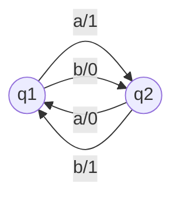

# Automata-simulator

This project is a simulator of Automata machines, which accepts as its input a file of the following configuration:

a1, a2, a3, a4, ...  
  
b1, b2, b3, b4, ...  
  
q1, q2 ...  
  

bi11, qj11 | bi12, qj12 | bi13, qj13 | bi14, qj14  
bi21, qj21 | bi22, qj22 | bi23, qj23 | bi24, qj24  

Where ai, bi are characters excluding commas and whitespaces,  
qi are substrings that also don't contain commas and whitespaces.

The file can also contain some input tape examples after the table.  
You can see an example of a configuration in [Test.txt](https://github.com/sona13asatryan/Automata-simulator/blob/main/Test.txt).  

This test discribes the following automata.

